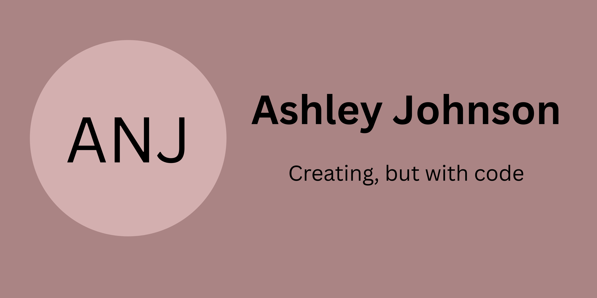

<!-- Banner placeholder -->

I'm a **full-stack developer** who loves blending code and **design** to create things that are both functional and engaging.
Currently exploring **AI** and building **agents**, integrating it into applications, and experimenting with ways to make technology smarter and more impactful.

---

## Core Skills
- **Languages:** Java · JavaScript · Typescript  
- **Frontend:** React · HTML · CSS
- **Backend:** Node.js · Express · Langgraph · Springboot
- **Database:** Mongodb · Mysql · Neo4j · Supabase   
- **Tools:** Docker · Git · AWS  

---

## Noticable Projects
- [BookHub](https://github.com/ashniv07/bookHub.git) → A react + spring boot project --> A whole new experience for managing and reading books  
- [SpookCode](https://github.com/ashniv07/spooky-thon.git) → A haloween themed IDE for learning your own coding

---

## GitHub Stats
  

---

## Currently On..
- Exploring **Ai tools**  
- Writing **smaller, smarter code**  
- Working with building smart agents  

---

Check me up on : [LinkedIn](https://www.linkedin.com/in/ashley-nivedha-johnson/) · [Portfolio](https://ashleynivedha-portfolio.vercel.app/)
